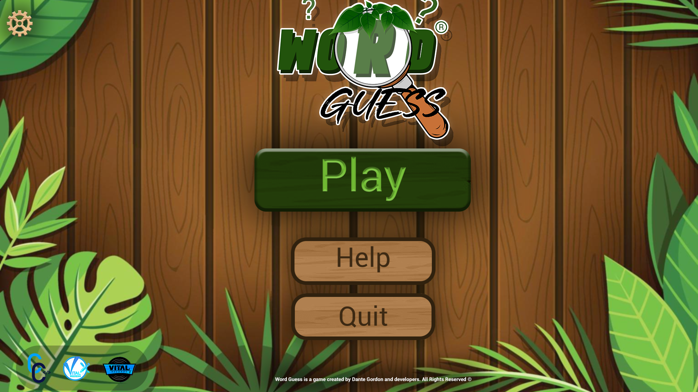
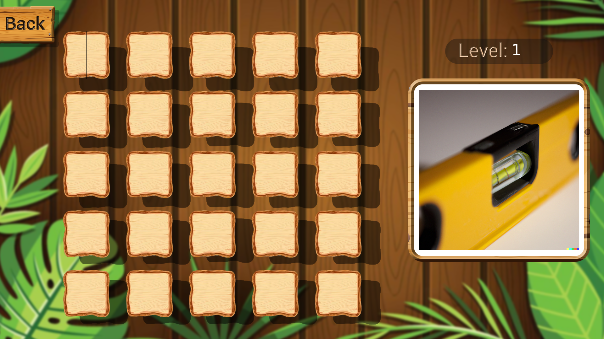
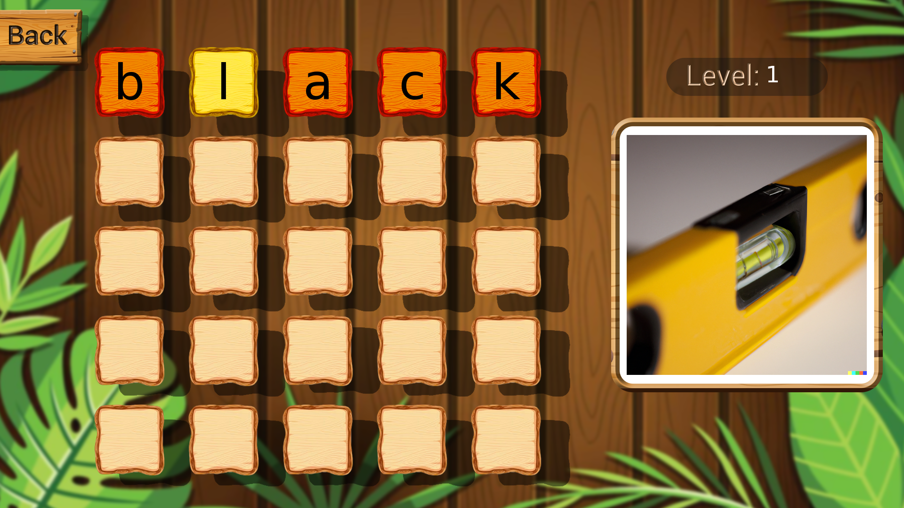
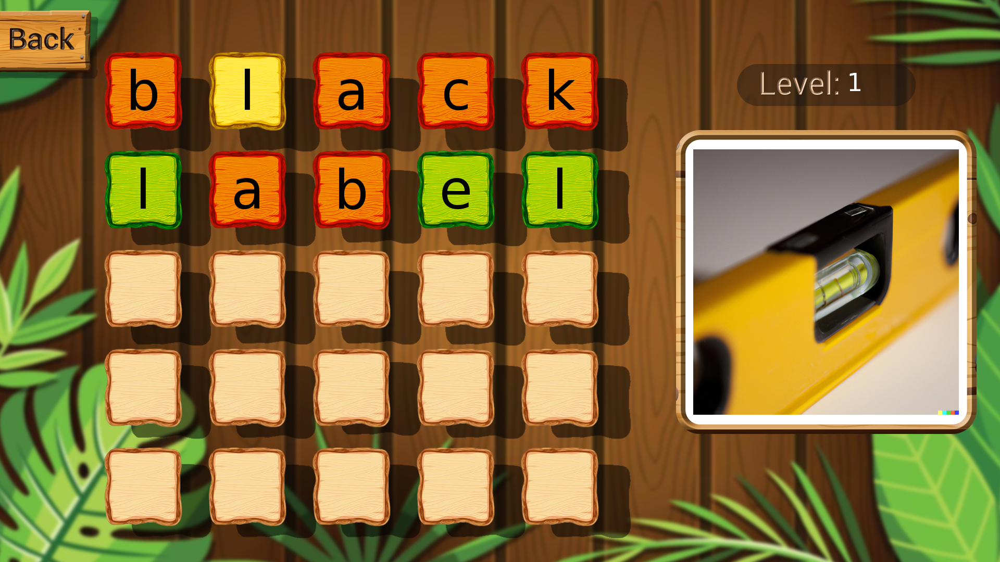
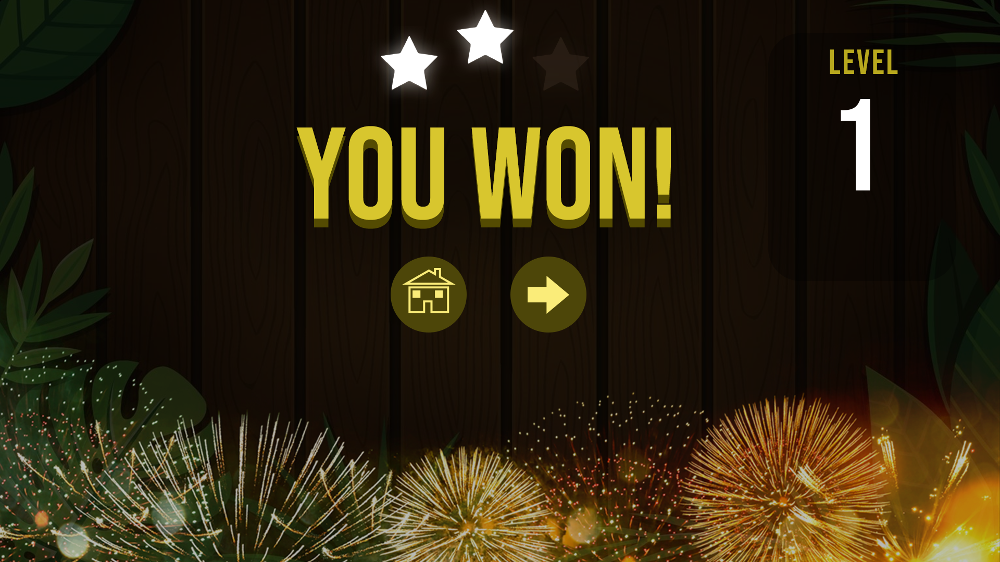
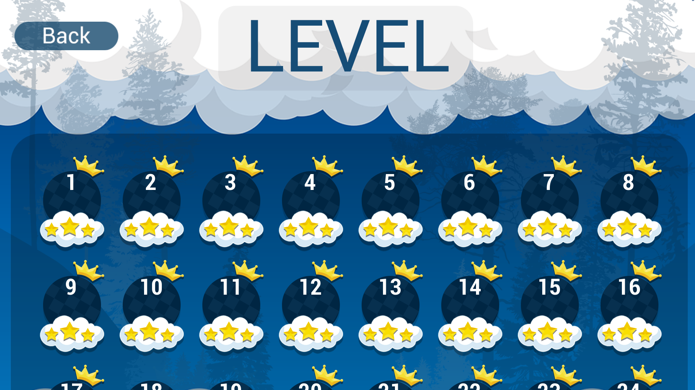

# Word Guess
- [*What is it?*](#what-is-it)
- [*How is it Played?*](#how-is-it-played)
- [*Limitations*](#limitations)
- [*How to build*](#how-to-build)
- [*Technologies used*](#technologies-used)
- [*Credits*](#credits)

## What is it?
---
A game created in c++ using SFML and TGUI

## *How is it played?*
---
Have you every played wordle, or 4 pics one word. It is just like that, except you guess a 5 letter word based on a specific image.

And you might be thinking, Why only 5 letter words, isn't that limiting. Yes, this is just a project i did for practice and I might upgrade it so that it can support more letters.

Anyway, lets get into it. As stated earlier the aim is to guess a word based on an image.Take this for example.

On the right you can see a picture. You can probably already guess that this is a *Level*. Funny enough the answer is right there, but we will not talk about that. Anyway, lets say you are unaware of construction tools,and just guess that the answer is black... doesn't make sense just bear with me.

Then lets input the word *Black* and press Enter.

As you can see. Black didn't really work. We got all redish-orange letters and one yellow, well what does that mean.

Letters that are Red denotes that the letter is not a part of the word as see with 'B' , 'A' , 'C' and 'K'

Letters that are  yellow  denotes that the letter is a part of the word but is not in the correct position, as seen where 'L' is supposed to start and end the word

Letters that are Green denotes that the letter is a part of the word and is in the correct position

Letters that are green or yellow may or may not appear multiple times

Finally when you have successfully guessed the word, you will be met with a victory screen

There are currently 140 levels

### Stars:
- 1 Guessed the word on 1st try
- 2 Guessed the word on 2nd try
- 3 Guessed the word on 3rd/4th try
- 0 Guessed the word on 5th try

## Limitations
---
- Only limited to 5 letter words, In the future there will be support for smaller and larger words
- Does not currently have any spell checker, so any string inputted will be accepted

## How to build
---
I am currently learning cmake so i do not currently have a build system, so for right now the only option is to clone the repository and open the solution file. for visual studio

## Technologies used
---
- [SFML 2.6.1](https://github.com/SFML/SFML) for window management
- [TGUI](https://github.com/texus/TGUI) for gui
- [jsoncpp](https://github.com/open-source-parsers/jsoncpp) for parsing json 

## Credits
---
- [Vital Records](https://www.instagram.com/_1vital/) Sound design
- [Vital Graphics](https://www.instagram.com/vitalgraphics/) UI Design
